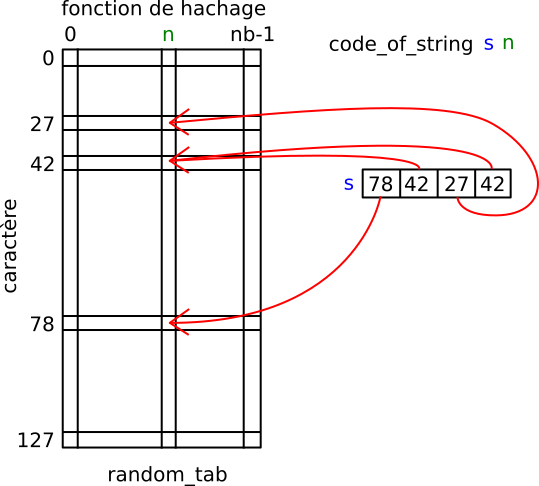

====================
Les filtres de Bloom
====================

Les tables de hachage sont utiles dans bien des cas. Si le nombre de
clés à stocker est très grand (comme, par exemple dans la cas d'une
base de données) alors la taille de la table est telle qu'il est
nécessaire de la stocker sur le disque. L'inconvénient à cela est que
les temps d'accès deviennent alors bien plus importants que lorsque la
table est stockée en mémoire. Si on doit de nombreuses fois tester
l'existence d'un élément dans la table cela peut devenir rédhibitoire.

Pour pallier ce problème, on peut ajouter une structure de données
intermédiaire qui servira d'*oracle*. L'oracle a la propriété
suivante : si un élément est présent dans la table alors il répondra
oui, si il n'est pas présent alors il répondra oui ou non. Cette
structure de données a pour but de limiter les requêtes inutiles :
pour tester la présence d'un élément dans la table on interroge
l'oracle avant d'interroger la table. Bien sûr, l'objectif est de
concevoir un oracle qui réponde rarement oui lorsque l'élément n'est
pas dans la table.

Le type d'oracle que nous allons implanter est lui-même une table de
hachage : il s'agit des **filtres de Bloom**. L'idée est la
suivante. On crée une table :math:`B` de booléens. On dispose pour les
clés que nous avons à ranger d'un certain nombre :math:`m` de
fonctions de hachage :math:`h_i, 0 \leq i \leq m-1`. Pour chaque clé
:math:`k` à ajouter à :math:`B`, au lieu de se contenter de mettre à
vrai la case :math:`B(h(k))` comme on le ferait classiquement, on va
mettre à vrai les :math:`m` cases :math:`B(h_i(k))`. Le principe
étant que la probabilité que deux clés différentes aient les mêmes
:math:`m` valeurs pour leurs fonctions de hachage est faible.

Par exemple, supposons que nous souhaitions entrer la clé "timoleon"
dans la table :math:`B` de taille 24, que nous ayons quatre fonctions de
hachage et que :math:`h_0("timoleon") = 2`, :math:`h_1("timoleon") = 12`,
:math:`h_2("timoleon") = 3`, :math:`h_3("timoleon") = 20`. L'état de la table :math:`B`
après l'insertion sera :

.. tikz::
   Représentation du filtre après insertion de la clé "timoléon". Une case noire représente la valeur vrai.

   [scale=0.5]
   \foreach \i in {0,...,23} {
     \draw (\i,0) rectangle +(1,1);
     \draw (\i,0) +(0.5,-0.3) node (x\i) {\tiny \i};
   }
   \foreach \i in {2,3,12,20} {
     \draw[fill=black] (\i.1,0.1) rectangle +(0.8,0.8);
   }

Pour savoir si une clé est présente, on s'assurera que les :math:`m` cases de
la table :math:`B` correspondant aux valeurs des :math:`m` fonctions de hachage sont
positionnées à vrai.

Le but du TP est d'implémenter un filtre de Bloom et de tester
l'efficacité de celui-ci en faisant varier sa taille ainsi que
le nombre de fonctions de hachage. Pour mesurer l'efficacité on
estimera le taux de faux positifs, c'est-à-dire le ratio entre le nombre
de fois où le filtre se trompe et le nombre de clés interrogées.

#. Récupérez les `sources <./tp-bloomfilter.zip>`__.

   Vous trouverez un module :mod:`bloomfilter` où vous implanterez les
   primitives de manipulation d'un filtre de Bloom, et un programme
   :file:`test.py`. Un programme gnuplot :file:`tp-bloom.plt` est également
   fourni pour tracer les courbes.

-----------------------------------------------
Fonctions de hachage d'une chaîne de caractères
-----------------------------------------------

Nous allons supposer que nous manipulons des clés qui sont des chaînes
de caractères écrites avec les 128 premiers caratères de la table
ASCII. 

Afin d'obtenir différentes fonctions de hachage, nous allons attribuer
un code différent aux caractères pour chaque fonction de hachage. Le
code d'un caractère sera obtenu de manière aléatoire. A cette fin on
a créé un tableau :code:`random_tab` contenant tous ces codes (voir la
figure).

   Le tableau :code:`random_tab`. La taille du tableau est égal
   au nombre de fonctions de hachage (en abscisse) multiplié par le
   nombre de caractères (en ordonnée). Le code d'un caractère (par
   exemple le caractère 78 de la table ASCII) pour une fonction de
   hachage :math:`n` donnée est obtenu en lisant la colonne :math:`n`
   correspondante (la case 78).

Ce tableau peut être initialisé grâce à la fonction
:code:`init_random_tab` (voir le fichier
:file:`test.py`). N'oubliez pas d'appeler une **et
une seule** fois cette fonction dans vos tests, sinon vous aurez des
résultats curieux.

#. Écrire le corps de la fonction :code:`code_of_string` qui, étant
   donnée une chaîne :code:`s` et un numéro :code:`n` calcule la
   somme des valeurs des codes des caractères. Le code calculé servira
   à la :math:`n` -ième fonction de hachage pour la chaîne
   :code:`s`. Cette fonction n'est pas à proprement parlé la fonction
   de hachage puisqu'on n'est pas assuré que le code renvoyé soit
   compris entre 0 et la taille de la table (qu'on ne connaît pas
   encore).

----------------------------
Le module :mod:`bloomfilter`
----------------------------

Ce module va implanter un filtre de Bloom qui associe un booléen à une
clé. Il contient trois primitives :

.. autofunction:: bloomfilter.create

.. autofunction:: bloomfilter.add

.. autofunction:: bloomfilter.contains

La fonction :code:`create` prend ainsi en second paramètre la
fonction qui fournit le code associé à une clé insérée dans le
filtre. Un exemple d'appel à cette fonction est ::

  create(4,code_of_string,nb_hash_functions)

#. Écrire le code des trois fonctions du module :code:`Bloomfilter`.

#. Tester vos fonctions en utilisant le programme de test déjà écrit
   qui insère le mot "timoleon" puis teste sa présence dans le filtre
   et la présence d'un mot aléatoire.

#. Trouver une taille du filtre pour laquelle un mot tiré au hasard
   apparaît présent, ce qui veut dire qu'on a un faux positif.

---------------------------
L'analyse des faux-positifs
---------------------------

Maintenant que vous disposez d'un filtre de Bloom fonctionnel, vous
allez pouvoir tester l'influence du nombre de fonctions de
hachage et de la taille du filtre sur le nombre de faux positifs.

Pour réaliser ces tests nous allons faire varier :
- le nombre de fonctions de hachage de 1 à 8
- la taille du filtre de :math:`2^{10}` à :math:`2^{20}`

Pour chaque jeu de test, nous allons construire un filtre de Bloom et
y insérer :math:`2^{10}` mots tirés au hasard. Une fois ces mots
insérés, on tirera au hasard :math:`2^{14}` mots de tests dont on
testera la présence. Il ne faudra pas oublier de s'assurer que les
mots de test ne sont pas dans le jeu de mots insérés initialement. Le
pseudo-code est donc ::

  creer l'ensemble des mots à inserer I
  pour n = 1 à 8 faire
    pour t = 10 à 20 faire
      creer un filtre de bloom BF de taille 2^t à n fonctions de hacahge
      inserer les mots de I dans BF
      pour k = 1 to 2^14 faire
        tirer un mot au hasard U
        si U n'appartient pas à I alors
          augmenter le compteur de mots testés
          si U appartient à BF alors
            augmenter le compteur de faux positifs 
          fin si
        fin si
      fin pour
      imprimer dans cet ordre:
         la taille du filtre, le nombre de fonctions, le nombre de mots testes, 
         le nombre de faux positifs, le taux de faux positifs
    fin pour
    imprimer deux lignes vides
  fin pour

#. Ecrire une procédure test correspondant à l'algorithme donné
   ci-dessus. Afin de s'assurer de la compatibilité avec les fichiers
   distribués pour ce TP, vous respecterez l'ordre dans lequel les
   boucles sont faites et l'ordre dans lequel les impressions sont
   effectuées.

   Vous devriez avoir un résultat similaire à : ::

     10 1 16383 10537 0.643167
     11 1 16385 6584 0.401831
     12 1 16385 3663 0.223558
     13 1 16385 1866 0.113885
     14 1 16385 1035 0.063168
     15 1 16385 529 0.032286
     16 1 16385 267 0.016295
     17 1 16385 174 0.010619
     18 1 16385 164 0.010009
     19 1 16385 164 0.010009
     20 1 16385 159 0.009704
     
     
     10 2 16385 12562 0.766677
     11 2 16385 6634 0.404883
     ...
     

#. Enregistrer vos résultats dans un fichier nommé
   :code:`res.txt`. 

#. Utiliser le programme Gnuplot :code:`tp-bloom.plt` pour tracer
   la courbe des résultats obtenus. ::

     gnuplot < tp-bloom.plt

#. Commenter.
         
