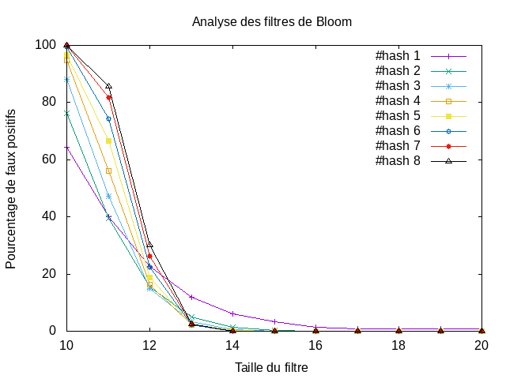

---------------
 tp-bloom
---------------
TP réalisé par ait ali belkacem et bekkouche

.. toctree::
   :maxdepth: 1

   bloomfilter.rst

~~~~~~~~~~
Etat du TP
~~~~~~~~~~

Décrivez ici l'état d'avancement du TP.

~~~~~~~~~~~~~~~~~~~~~~
Réponses aux questions
~~~~~~~~~~~~~~~~~~~~~~

vous trouverez le fichier "res.txt" et "tp4.png" dans le dossier src

Question 2.4.3
--------------
On peut constater que:

    Lorsque la table du filtre est petite : Plus le nombre de fonctions de hachage est grand, plus il y a de faux positifs (cf droite verticale)
    Lorsque la table du filtre augmente : La tendance d'inverse, Plus le nombre de fonctions de hachage est grand, moins il y a de faux positifs (croisement des droites)

