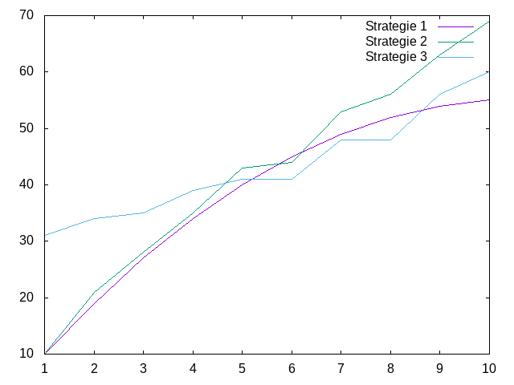
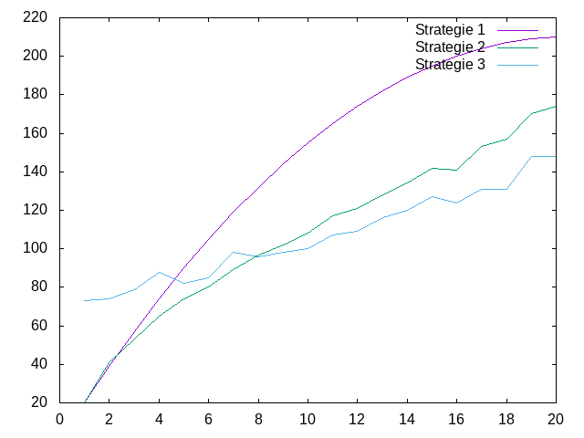
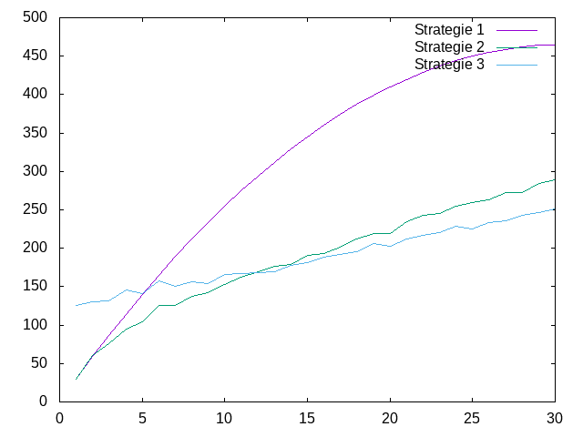
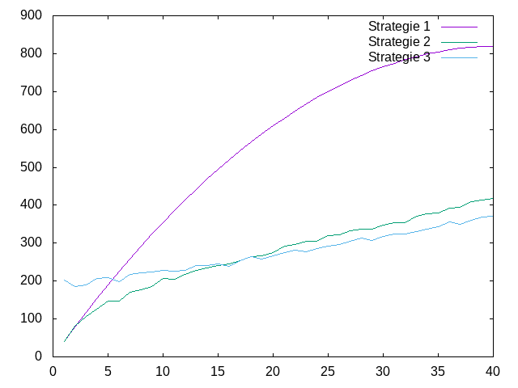
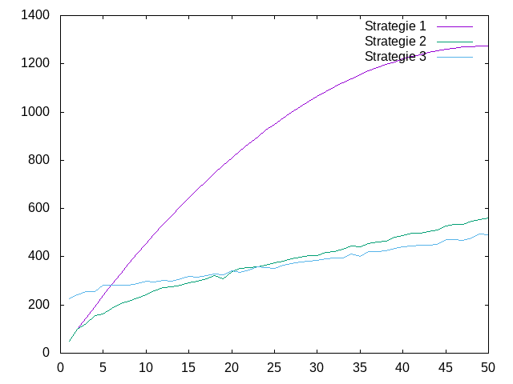
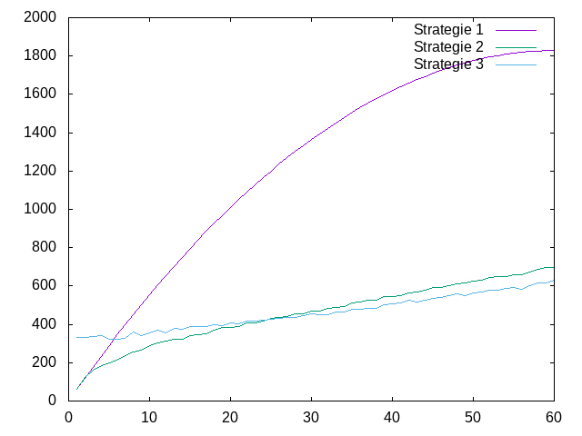
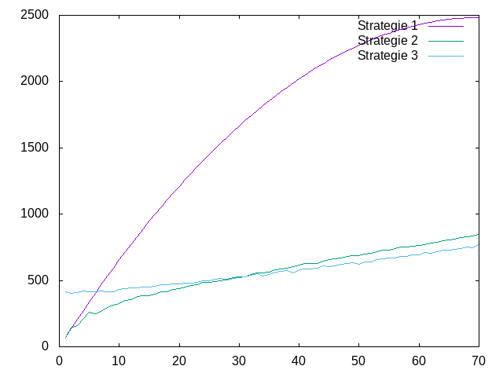
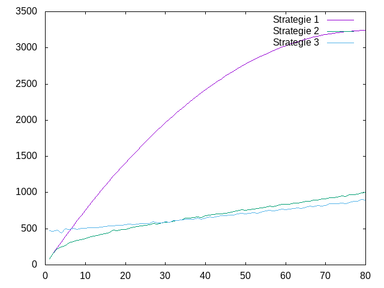
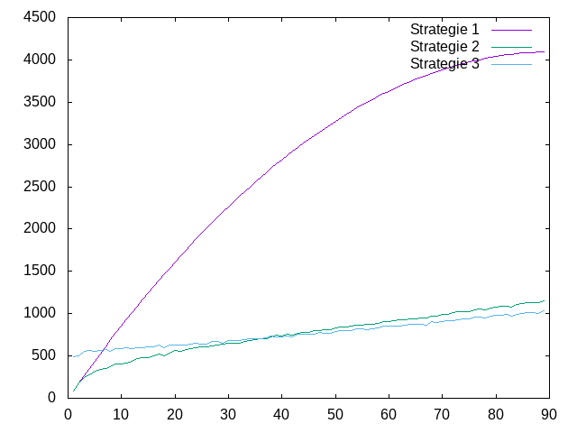

---------------
Experimentateur
---------------

.. toctree::
   :maxdepth: 1

   experience.rst
   marker.rst
   
~~~~~~~~~~
Etat du TP
~~~~~~~~~~
Tp réalisé par ait ali belkacem azzedine et bekkouche inas

Vous trouverez Dans le fichier test.py, le code des trois fonctions( negative_marker1 ,  negative_marker2 ,negative_marker3)qui donne la liste des markers negative

Dans le dossier fichiers_dat vous trouverez tous les 10 fichiers(selon les valeurs de m) en extension ".dat" qu'il nous a été demandé de générer.

Dans le dossier fichiers_png vous trouverez tous les  graphes générés des fichiers en extension ".dat"  cités ci-dessus grâce à GNUPLOT

~~~~~~~~~~~~~~~~~~~~~~
Réponses aux questions
~~~~~~~~~~~~~~~~~~~~~~

Question 1.2.2
--------------

Pour étudier la complexité de l'algorithme, je propose de compter le nombre de comparaisons entre les valeurs du tableau des marqueurs ainsi que celles des marqueurs positifs.

Question 1.2.3
--------------

Non il n'existe pas un pire des cas car a chaque fois on trouve le meme nombre de comparaison c'est a dire que pour n'import emplacement de nos marqueurs positif dans le tableau des maqueurs on trouvera toujours le meme nombre de comparaison

Question 1.2.4
--------------

Pour notre pire des cas le nombre de comparaison qui sera efféctuer est  C1(m,p)=(m*p+1)/2+m

Question 1.2.4
--------------

Oui,il existe un pire des cas pour ce 2ème algorithme c'est  quand notre tableau de marqueurs positifs est trié d'une manière alternée c'est a dire  il prend premier marqueur en premiere position  et le plus grand en deuxieme ainsi de suite.

C2(m,p)=p*log2(p)+[somme de 1 à m](log2(p))
car la complexité du tris fusion au pire des cas c'est O(nlog(n)).

Question 1.4.2
--------------
oui,il existe un pire des cas c'est quand nos deux tableaux de marqueurs 
sont triés d'une maniere altérné par exemple [premier_markers,dernier_markers,deuxieme_markers,avantdernier_markers....]
donc on aura a trié deux tableaux rangés de cette maniere

C3(m,p)=m*log(m)+p*log(p)+[(p*p)+m-P]

Question 1.5.2
--------------
Pour m=10 et p=5 on trouve le nombre de comparaison pour:

la première version:40

la deuxieme version : 43

la troisieme version:41

Donc on constate que pour cet exemple est mieux de se servir de la version 1 y'as pas de pire cas dans cette version donc pour n'import quelle rangement des marqueurs ca sera toujours 40 par contre a la version 2 et 3
sa coutera plus en terme de comparaison si les marqueurs sont placés de la manière décrite au dessus 

Inclusion des graphes
---------------------

m=10
----

m=20
----

m=30
----

m=40
----

m=50
----

m=60
----

m=70
----

m=80
----

m=90
----

m=100
----

Conclusion:
----------

On conclut que en variant les longueurs des tableaux de marqueurs varie aussi la compléxité en terme de comparaison et au final on déduit que pour les des grande longueures de tableau la troisieme version est plus pérformente et on remarque des graphes que pour chaque valeur de (m) il existe une valeur de (p) pour qu'a partir de cette valeur une des version est plus performante et plus on augmente la valeur de (m) plus la version 3 est plus performante a partir d'une valeur (p). 

