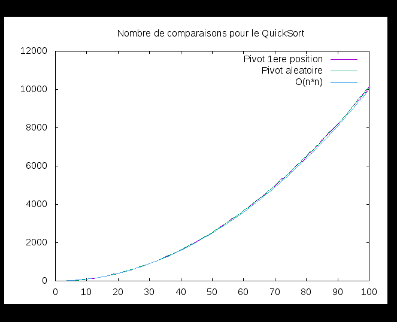
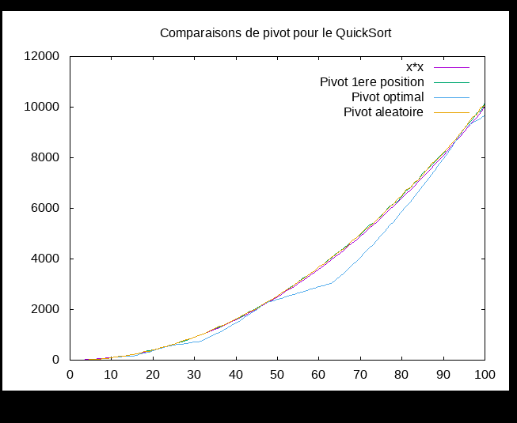
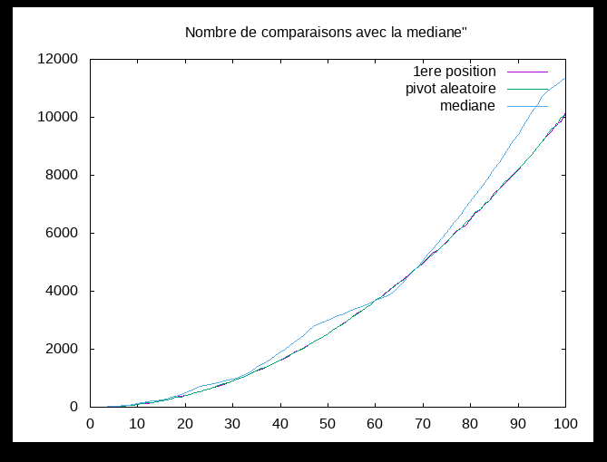
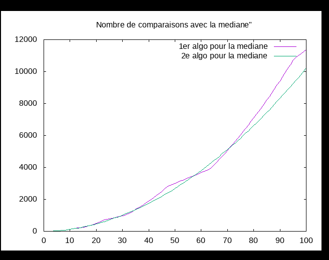

---------
Quicksort
---------

.. toctree::
   :maxdepth: 1

   modules.rst

~~~~~~~~~~
Etat du TP
~~~~~~~~~~
TP réalisé par ait ali belkacem azzedine et bekkouche inas

La question 2.8 n'est pas traitée.

pour les questions vides c'est les question 

~~~~~~~~~~~~~~~~~~~~~~
Réponses aux questions
~~~~~~~~~~~~~~~~~~~~~~
   
~~~~~~~~~~~~~~~~~~~~~~~~~
Rappels sur le tri rapide
~~~~~~~~~~~~~~~~~~~~~~~~~

Question 2.1
--------------

Le tri par sélection, le tri par insertion et le tri bulle sont d'autres exemples de tri sur place.

Question 2.3
--------------

Le pivot est bien placé, et on vérifie que les éléments inférieurs au pivot soient bien dans la première tranche du tableau, et les éléments supérieurs au pivot dans la seconde tranche.
Lors du parcours de la première tranche, si on rencontre un élément supérieur au pivot, ça signifie qu'il y a un élément inférieur au pivot dans la seconde tranche, on cherche alors ce dernier et on échange les deux éléments.

Question 2.8
------------

~~~~~~~~~~~~~~~~~~
Sélection du pivot
~~~~~~~~~~~~~~~~~~
Pivot aléatoire
-----------------

Question 3.3
--------------
Pour compter le nombre de comparaisons effectuées par le tri rapide, on ajoute une variable globale cpt que l'on incrémente à chaque appel de la fonction de comparaison. Les modifications sont effectuées dans 

Question 3.4
-------------

On remarque que les deux alogorithmes sont équivalents en terme de comparaisons, et que leur complexité asymptotique est bien en O(n²).

Question 3.5
------------
Pour le tri rapide, le pire des cas pour le choix du pivot aléatoire est lorsque le minimum des valeurs du tableau est choisi comme pivot.
L'équation de récurrence de la complexité est alors:

.. math:: c_p (n) = c_p (n-1) + n = \frac{n(n+1)}{2} = O(n²)

Pivot optimal
--------------
Question 4.1
-------------
Théoriquement la meilleure valeur pour le pivot est la médiane des valeurs du tableau.

Question 4.4
--------------

La courbe obtenue est :

On remarque que le pivot optimal est meilleur globalement que les deux autres pivots.
Les pivots aléatoire et de 1ère position ont un nombre de comparaisons semblable de complexité asymptotique O(n²).

Question 4.5
--------------
L'équation de récurrence du tri rapide avec la médiane comme choix de pivot est:

.. math:: c(n) = 2 * c(\frac{n}{2}) + n

Et grâce au théorème général on obtient dans le meilleur des cas:

.. math:: c(n) = O(n*log_2 (n))

Pivot réellement optimal?
---------------------------
Question 5.1
--------------

Avec l'ajout des comparaisons lors de la recherche de la médiane, le QuickSort avec le pivot comme étant la médiane a sa complexité au-dessus des QuickSort avec les autres choix de pivot.

Question 5.2
--------------

function  find_median dans le module sorting

function  find_median_aux dans le module sorting

On remarque que le 2ème algorithme est meilleur en terme de nombre de comparaisons, mais pas de beaucoup. 
