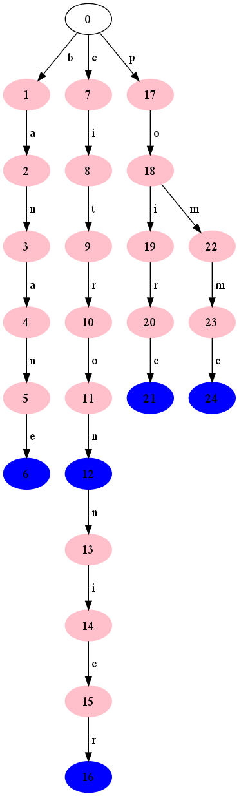
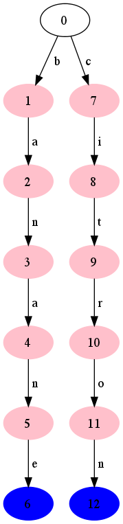
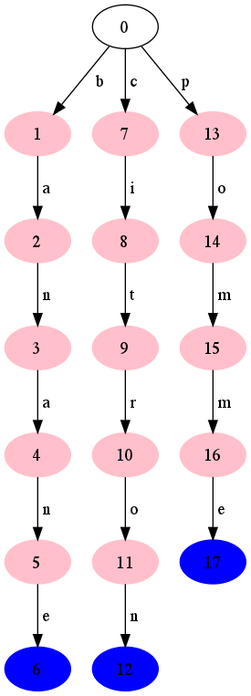
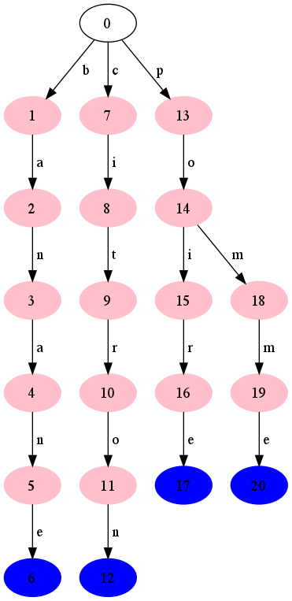
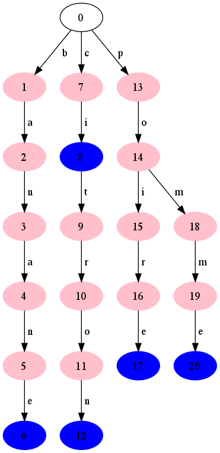
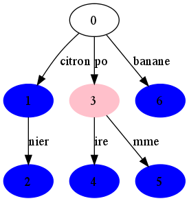
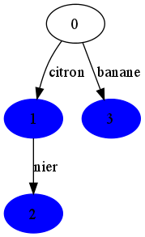
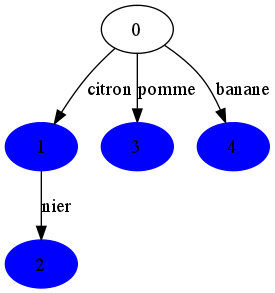
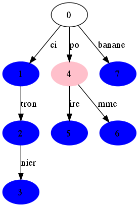

===========================================================
Une structure de données arborescente pour stocker des mots
===========================================================

Le but du TP est l'implémentation d'une structure de données appelé
trie (prononcer try). Le nom provient du mot anglais
re{**trie**}val. Cette structure de données a été introduite dans
les années 60 par Edward Fredkin.

Un trie est une structure arborescente ordonnée qui permet de stocker
de manière assez efficace un ensemble de mots. Elle permet également
d'obtenir la réponse à la présence d'un mot rapidement : en temps
linéaire par rapport à la longueur du mot recherché. La figure ci-dessous
représente le trie stockant les mots
"banane", "citron", "citronnier", "pomme" et "poire". On remarquera que
deux mots ayant même préfixe sont sur la même branche de l'arbre, ce
qui permet de minimiser l'espace mémoire utilisé.

#. Récupérez les `sources <./tp-trie.zip>`__.

   Dans l'archive vous trouverez dans un répertoire
   :file:`src-java/src` : deux programmes principaux dans les
   classes :mod:`TrieMain` et :mod:`CompactTrieMain`. Vous adopterez
   la méthodologie vue en POO pour écrire vos codes Java.

   Pour les étudiants en mathématiques (et pour eux-seuls) vous
   trouverez dans un répertoire :file:`src` les modules
   :mod:`trie` et :mod:`compacttrie` ainsi que les programmes
   :file:`testtrie.py` et :file:`compacttesttrie.py` vous permettant
   de réaliser le TP en Python.

-----------------------
Construction  d'un trie
-----------------------

Une différence majeure avec les arbres déjà rencontrés est que les
arcs sont étiquetés et que l'arité de chaque nœud est variable.

#. Proposer des déclarations de types permettant de représenter un
   arbre dans la classe :mod:`Trie` (le module :mod:`trie` pour la
   réalisation en Python). Faites valider par votre enseignant.
   (**les numéros des nœuds ne sont là que pour faciliter la lecture, ils ne sont pas stockés dans l'arbre**)

#. Dessiner la représentation dans votre structure de données
   de l'arbre donné en exemple.

#. Qu'est-ce qu'un trie vide ? Ecrire la documentation puis le code du
   constructeur (ou de la fonction :code:`new_trie`).

---------------------------
Ajouts de mots dans le trie
---------------------------

L'ajout d'un mot dans l'arbre se fait assez facilement par
récurrence. Soit il existe un fils dont l'arc est étiqueté par la
première lettre du mot, soit il n'en existe pas. Dans le second cas on
crée le nœud fils et on se retrouve ainsi dans le premier cas. Il
suffit alors d'ajouter le reste du mot dans le nœud fils, jusqu'à
avoir épuisé toutes les lettres du mot.

Ci-dessus, le processus d'ajout des mots "pomme" puis "poire" puis
"ci" au trie contenant "banane" et "citron". Comme il n'existe pas de
fils étiqueté "p" à la racine, l'ajout de "pomme" se fait en créant ce
fils et en y ajoutant "omme", récursivement. Comme il existe déjà un
chemin débutant par les étiquette "p" et "o", l'ajout de "poire" se
fait en suivant ce chemin puis en créant un nouveau fils au
nœud 14. Comme il existe déjà un chemin pour le mot "ci", l'ajout
de celui-ci se fait simplement en marquant le nœud 8 final.

#. Écrire la Javadoc (en anglais) de la classe :mod:`Trie` (pour les
   mathématiciens, écrire la documentation du module).

#. Compléter le code des fonctions :code:`add` puis :code:`contains`.

#. (pour les licence info) Écrire les tests unitaires des
   méthodes :code:`add` et :code:`contains`.

#. Tester sur de plus grands exemples (par exemple en utilisant des
   listes de mots disponibles ici : `<http://www.liste-de-mots.com/>`_.

         
-------------------
Affichage d'un trie
-------------------

On souhaite maintenant afficher l'arbre. Plutôt que procéder à un
affichage texte nous allons utiliser une bibliothèque de programmes
permettant de représenter des arbres à partir d'une description
textuelle. Il s'agit de la bibliothèque graphviz. Le programme
:code:`dot` permet de prendre en entrée une description au format dot
et produit une image. Le makefile fourni contient la commande pour
produire cette image.

L'arbre de la figure ci-dessus sera décrit comme
ci-dessous. On trouve deux styles de lignes : les lignes décrivant les
nœuds et les lignes décrivant les arcs. Les numéros des nœuds
ne sont pas stockés dans l'arbre, ils sont créés au fur et à mesure du
parcours de l'arbre pour son impression.

::

    digraph G {
      1 [style=filled,color=pink];
      0 -> 1 [label=" b"];
      2 [style=filled,color=pink];
      1 -> 2 [label=" a"];
      3 [style=filled,color=pink];
      2 -> 3 [label=" n"];
      4 [style=filled,color=pink];
      3 -> 4 [label=" a"];
      5 [style=filled,color=pink];
      4 -> 5 [label=" n"];
      6 [style=filled,color=blue];
      5 -> 6 [label=" e"];
      7 [style=filled,color=pink];
      0 -> 7 [label=" c"];
      8 [style=filled,color=pink];
      7 -> 8 [label=" i"];
      9 [style=filled,color=pink];
      8 -> 9 [label=" t"];
      10 [style=filled,color=pink];
      9 -> 10 [label=" r"];
      11 [style=filled,color=pink];
      10 -> 11 [label=" o"];
      12 [style=filled,color=blue];
      11 -> 12 [label=" n"];
      13 [style=filled,color=pink];
      12 -> 13 [label=" n"];
      14 [style=filled,color=pink];
      13 -> 14 [label=" i"];
      15 [style=filled,color=pink];
      14 -> 15 [label=" e"];
      16 [style=filled,color=blue];
      15 -> 16 [label=" r"];
      17 [style=filled,color=pink];
      0 -> 17 [label=" p"];
      18 [style=filled,color=pink];
      17 -> 18 [label=" o"];
      19 [style=filled,color=pink];
      18 -> 19 [label=" i"];
      20 [style=filled,color=pink];
      19 -> 20 [label=" r"];
      21 [style=filled,color=blue];
      20 -> 21 [label=" e"];
      22 [style=filled,color=pink];
      18 -> 22 [label=" m"];
      23 [style=filled,color=pink];
      22 -> 23 [label=" m"];
      24 [style=filled,color=blue];
      23 -> 24 [label=" e"];
    }

#. Dans un premier temps on omettra les lignes décrivant
   les nœuds (dot peut se passer de la description des nœuds). Réaliser
   la fonction :code:`print` qui affiche à l'écran la description
   au format dot. Tester. Vous devriez obtenir quelque chose comme ceci.

    ::
    
        digraph G {
          0 -> 1 [label=" b"];
          1 -> 2 [label=" a"];
          2 -> 3 [label=" n"];
          3 -> 4 [label=" a"];
          4 -> 5 [label=" n"];
          5 -> 6 [label=" e"];
          0 -> 7 [label=" c"];
          7 -> 8 [label=" i"];
          8 -> 9 [label=" t"];
          9 -> 10 [label=" r"];
          10 -> 11 [label=" o"];
          11 -> 12 [label=" n"];
          12 -> 13 [label=" n"];
          13 -> 14 [label=" i"];
          14 -> 15 [label=" e"];
          15 -> 16 [label=" r"];
          0 -> 17 [label=" p"];
          17 -> 18 [label=" o"];
          18 -> 19 [label=" i"];
          19 -> 20 [label=" r"];
          20 -> 21 [label=" e"];
          18 -> 22 [label=" m"];
          22 -> 23 [label=" m"];
          23 -> 24 [label=" e"];
        }

#. Ajouter maintenant la description des nœuds. Tester. 

---------------------------
Version compactée d'un trie
---------------------------

On se rend compte sur l'exemple que le mot banane ne possède pas de
préfixe commun avec un autre mot. La succession des nœuds de l'arbre
est un peu inutile. La même remarque peut être faite pour le préfixe
citron.

On décide donc de ne plus  étiqueter les arcs par des caractères mais
par des chaînes de caractères. La version compacte de l'arbre figure
ci-dessus est donnée ci-dessous.

L'ajout d'un mot est un peu plus complexe. L'ajout d'un mot dont il
existe déjà un préfixe est très semblable à l'ajout dans un
trie. Au lieu de descendre dans l'arbre, on va progresser tant qu'on
peut dans la chaîne représentant l'étiquette du nœud associé à la
première lettre du mot à insérer. Arrivé en bas de l'arbre, la
création d'un seul nœud est suffisante.

Par contre dans le cas de l'ajout d'un mot plus court (par exemple
l'ajout de citron après citronnier) ou d'un mot
possédant un préfixe commun (par exemple l'ajout de pomme après avoir
ajouté poire) nécessitera d'éclater un nœud.

Les figures ci-dessous illustrent cela.

.. image:: images/addc0.png 
   :width: 13%

#. Créer une classe :code:`CompactTrie` (un module
   :code:`compact_trie` pour la réalisation en Python) qui
   permettra de représenter un arbre trie compact.

#. Créer la fonction :code:`add`. Tester.

#. Créer la fonction :code:`contains`. Tester.

#. Créer la fonction :code:`print`. Tester.

#. (pour les licence info) Compléter en créant la Javadoc et des tests unitaires.

         
